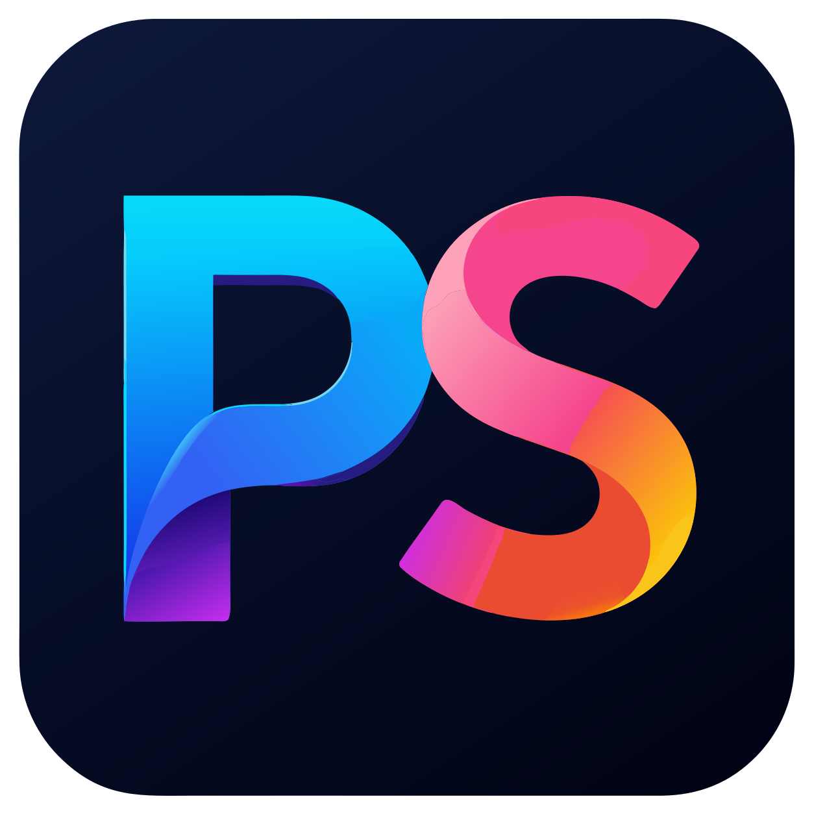
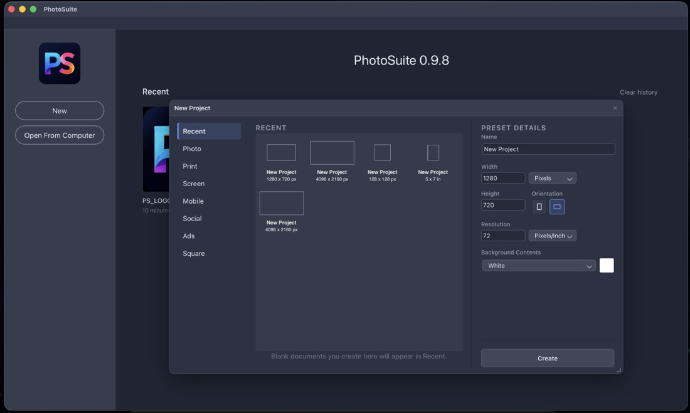
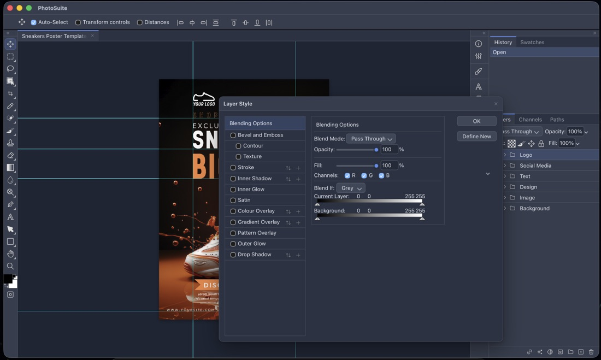
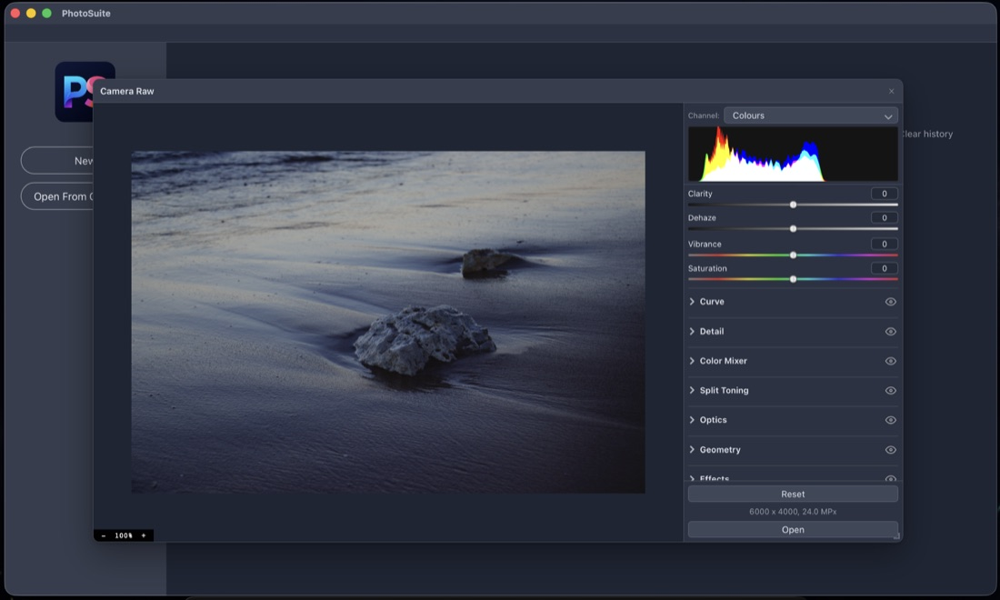
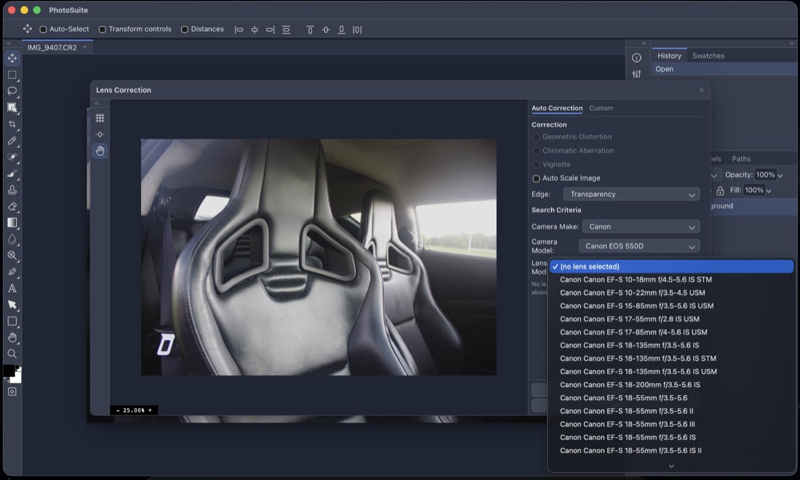
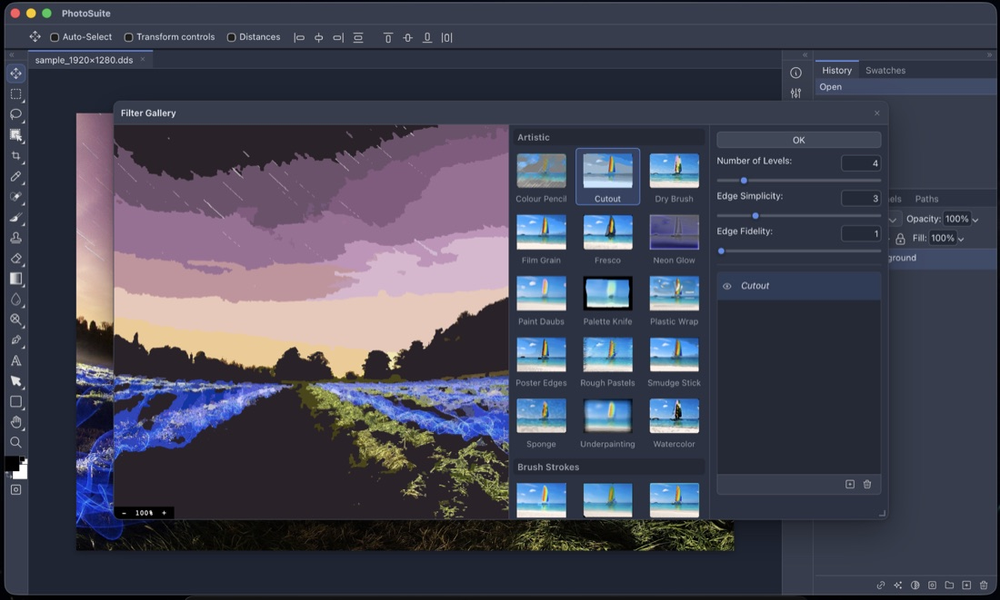
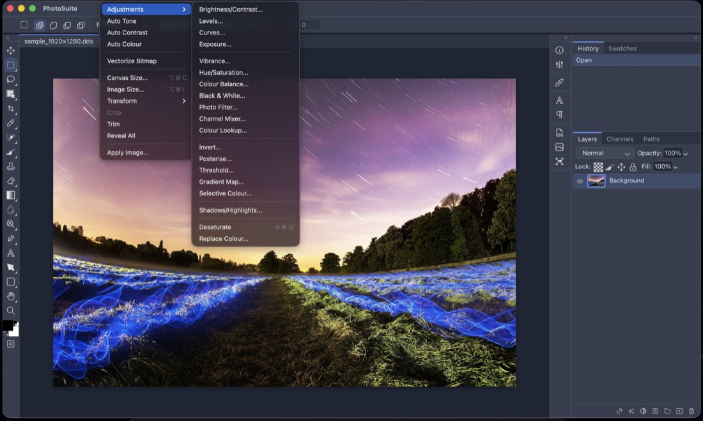

<p align="center">
  
</p>

<h1 align="center">PhotoSuite</h1>

<p align="center">
  <strong>A desktop image editor faithfully replicating classic Adobe Photoshop (~2020) with 1:1 native PSD/PSB compatibility.</strong>
</p>

<p align="center">
  <a href="https://github.com/eolix/photosuite/actions/workflows/build.yml"></a>
  <a href="https://v2.tauri.app"></a>
  <a href="https://github.com/eolix/photosuite/releases"></a>
  <a href="#open-source-used-here"></a>
</p>

<p align="center">
  <a href="#quick-start">Quick Start</a> •
  <a href="#downloads">Downloads</a> •
  <a href="#screenshots">Screenshots</a> •
  <a href="#what-this-is">What This Is</a> •
  <a href="#key-features">Features</a> •
  <a href="#supported-formats">Supported Formats</a> •
  <a href="#documentation">Documentation</a> •
  <a href="#building--testing">Building & Testing</a>
</p>

---

## Quick Start

```sh
# Clone with submodules included
git clone --recursive https://github.com/eolix/photosuite.git
cd photosuite

# Install dependencies and start in development mode
npm install
npm run dev
```

> **Note**: If already cloned without `--recursive`, initialise submodules before starting:
> ```sh
> git submodule update --init --recursive
> ```

---

## Downloads

Pre-built binary packages are available on the **[Releases](https://github.com/eolix/photosuite/releases)** page:

| Platform | Package Format | Architecture |
|:---|:---|:---|
| **macOS** | Universal `.dmg` | Apple Silicon (arm64) & Intel (x86_64) |
| **Linux** | `.deb`, `.rpm` | x86_64 |
| **Windows** | NSIS installer (`.exe`) | x64 |

---

## Screenshots

Click any image for the full-resolution version.

<table>
  <tr>
    <td align="center"><a href="website/screenshots/001.png"></a><br><sub><b>Start screen & New Project</b></sub></td>
    <td align="center"><a href="website/screenshots/002.png"></a><br><sub><b>Layer Style</b></sub></td>
    <td align="center"><a href="website/screenshots/003.png"></a><br><sub><b>Camera RAW develop</b></sub></td>
  </tr>
  <tr>
    <td align="center"><a href="website/screenshots/004.png"></a><br><sub><b>Lens Correction</b></sub></td>
    <td align="center"><a href="website/screenshots/005.png"></a><br><sub><b>Filter Gallery</b></sub></td>
    <td align="center"><a href="website/screenshots/006.png"></a><br><sub><b>Adjustments menu</b></sub></td>
  </tr>
</table>

---

## What This Is

PhotoSuite is a full-featured desktop raster and vector graphics editor designed with fidelity in mind rather than reinterpretation. Panels sit where you expect them, shortcuts match your muscle memory, dialogs expose identical fields, and tools behave exactly like the originals — right down to modifier keys. If you know Photoshop ~2020, you already know PhotoSuite.

* **PSD/PSB Native Format**: PSD is the native format, not a lossy import filter. Documents round-trip cleanly through the binary format: layer records, masks, blending modes, channel data, descriptors, layer effects, smart-filter stacks, text engine data, vector paths, slices, and colour profiles. A file saved in PhotoSuite opens in Photoshop with its layer tree intact, and vice versa. PSB is supported for large documents.
* **Offline-First & Private**: Built as a [Tauri v2](https://v2.tauri.app) application. The editor runs HTML5, WebAssembly, and WebGL inside the system webview, backed by a lightweight Rust host for filesystem access, native menus, dialogs, clipboard, and printing. Everything stays local on your machine with zero telemetry or cloud requirements.

> *Disclaimer*: Not affiliated with or endorsed by Adobe. Photoshop is a registered trademark of Adobe Inc., referenced here solely to describe the interface and behavioral specifications this project aims to replicate.

---

## Key Features

* **Layer Engine & Styles**:
  * Raster layers, vector layers, layer groups, clipping masks, and layer masks.
  * 1:1 Photoshop layer styles: Drop Shadow, Inner Shadow, Outer Glow, Inner Glow, Bevel & Emboss, Satin, Color Overlay, Gradient Overlay, Pattern Overlay, and Stroke.
  * Smart Objects and Smart Filter stacks with non-destructive editing.
  * Layer Comps palette and tracker.

* **Tools & Canvas Experience**:
  * Complete toolset: Marquee, Lasso, Magic Wand, Crop, Brush, Clone Stamp, Healing Brush, Eraser, Gradient, Blur/Sharpen, Dodge/Burn, Pen, Type, Shapes, Hand, Zoom, and Eyedropper.
  * Full canvas panning, zooming, rotation, pixel grid, rulers, and custom guides.
  * Deep History palette with snapshot support.

* **Filters & WebAssembly Acceleration**:
  * Classic Filter Gallery with multi-band runner and live thumbnails.
  * Liquify with interactive mesh warping.
  * Lens Correction backed by the [Lensfun](https://github.com/lensfun/lensfun) database.
  * WebAssembly-powered image processing (blur, median, WebP encode/decode, zstd compression, etc.).

* **Vector Geometry & Advanced Typography**:
  * Vector path geometry and boolean operations powered by [Paper.js](https://github.com/paperjs/paper.js).
  * High-fidelity font parsing via [Typr.js](https://github.com/photopea/Typr.js), complex text shaping via [HarfBuzz](https://github.com/harfbuzz/harfbuzz) (WASM), and bidirectional text layout via [FriBidi](https://github.com/fribidi/fribidi) (WASM).
  * Type along path, text warp, OpenType ligatures, kerning, and character/paragraph palettes.

* **Automation, Scripting & Extensibility**:
  * Photoshop Actions (`.atn`) parser and playback engine.
  * JavaScript/JSX scripting engine powered by [Acorn](https://github.com/acornjs/acorn).
  * Sandboxed sidebar plugins using plain HTML, CSS, and JavaScript communicating via IPC (see [PLUGINS.md](docs/PLUGINS.md)).

* **Native Desktop Integration**:
  * Native OS menus via Tauri.
  * Direct printing support (CUPS on macOS/Linux, Windows Spooler on Windows).
  * Drag-and-drop file loading and native OS file dialogs.

---

## Supported Formats

PhotoSuite opens and exports a comprehensive range of raster, vector, and digital design formats:

| Category | Supported Formats |
|:---|:---|
| **Native & Adobe** | PSD, PSB, Adobe Illustrator (`.ai`), Adobe XD (`.xd`) |
| **Standard Raster** | PNG, APNG, JPEG, WebP, AVIF, TIFF, GIF, BMP, TGA, OpenEXR (`.exr`) |
| **Vector & Document** | SVG, PDF, PostScript (`.ps`), EPS, EMF, WMF, DXF |
| **Digital Design** | Sketch (`.sketch`), Figma (`.fig`), Affinity Photo/Designer (`.af` - WIP), GIMP (`.xcf`) |
| **Camera RAW** | DNG, CR2, NEF, ARW, and standard camera RAW formats |

---

## Documentation

Comprehensive architecture guides and development documentation are located in [`docs/`](docs/):

| Document | Description |
|:---|:---|
| **[docs/ARCHITECTURE.md](docs/ARCHITECTURE.md)** | Codebase architecture, module layering rules, directory layout, and design principles. |
| **[docs/PLUGINS.md](docs/PLUGINS.md)** | Guide to writing sidebar plugins using standard HTML, CSS, and JavaScript. |
| **[tests/README.md](tests/README.md)** | Behavioural test suite documentation, test harness, and mocking guidelines. |
| **[src/vendor/README.md](src/vendor/README.md)** | Complete third-party vendor provenance, pinned commits, upstream licenses, and build scripts. |

---

## Building & Testing

### Prerequisites
* **Node.js**: v25 or newer
* **Rust**: Current stable toolchain (`rustup`)
* **Tauri Prerequisites**: Platform dependencies for [Tauri v2](https://v2.tauri.app/start/prerequisites/)

### Commands

```sh
npm run dev        # Launch the app from source with Tauri
npm run build      # Build the production application bundle for your current platform
npm test           # Run the behavioral test suite (1,600+ tests)
npm run verify     # Verify imports, cyclic dependencies, static bindings, and bootstrap
npm run lint       # Run ESLint across src/
```

Automated cross-platform builds (macOS universal, Linux deb/rpm, Windows x64) are run on every release tag via [GitHub Actions](.github/workflows/build.yml).

---

## Inspiration and Prior Art

The primary inspiration for this project is **[Photopea](https://www.photopea.com)**, Ivan Kutskir's browser-based editor, which demonstrated that a desktop-class image editor with complete PSD fidelity is achievable in a web runtime. The author has also open-sourced many format libraries utilised by this project. An archive snapshot is available at [ruanjiyang/Photopea-Offline](https://github.com/ruanjiyang/Photopea-Offline).

---

## Open Source Used Here

All third-party libraries live in [`src/vendor/`](src/vendor/README.md) as pinned git submodules with their respective upstream licenses:

* **From the Photopea Author**: [UPNG.js](https://github.com/photopea/UPNG.js) (PNG/APNG), [UTIF.js](https://github.com/photopea/UTIF.js) (TIFF), [UZIP.js](https://github.com/photopea/UZIP.js) (ZIP/deflate), [Typr.js](https://github.com/photopea/Typr.js) (font parsing & shaping), [UTEX.js](https://github.com/photopea/UTEX.js) (TeX typesetting). *All MIT*.
* **Core Libraries**: [pako](https://github.com/nodeca/pako) (zlib, MIT), [Paper.js](https://github.com/paperjs/paper.js) (vector geometry, MIT), [omggif](https://github.com/deanm/omggif) (GIF, MIT), [js-sha1](https://github.com/emn178/js-sha1) (MIT), [acorn](https://github.com/acornjs/acorn) (JS parser, MIT), [linear-solve](https://github.com/lovasoa/linear-solve) (MIT), [parse-exr](https://github.com/dmnsgn/parse-exr) (OpenEXR, MIT), [pdf.js](https://github.com/mozilla/pdf.js) (JPEG/JPX/JBIG2 codecs, Apache-2.0), [PDFI.js](https://github.com/eolix/PDFI.js) (PDF/PS/EMF/WMF, MIT).
* **WebAssembly Modules**: [HarfBuzz](https://github.com/harfbuzz/harfbuzz) (text shaping, MIT), [FriBidi](https://github.com/fribidi/fribidi) (bidirectional text, LGPL-2.1+), [libwebp](https://github.com/webmproject/libwebp) (BSD-3), [zstd](https://github.com/facebook/zstd) (BSD-3), [stb_image](https://github.com/nothings/stb) (Public domain / MIT), [libheif](https://github.com/strukturag/libheif) (LGPL-3.0+).
* **Data & Assets**: [Lensfun](https://github.com/lensfun/lensfun) for camera and lens profile data (LGPL / CC), and [Tabler Icons](https://github.com/tabler/tabler-icons) (MIT).
