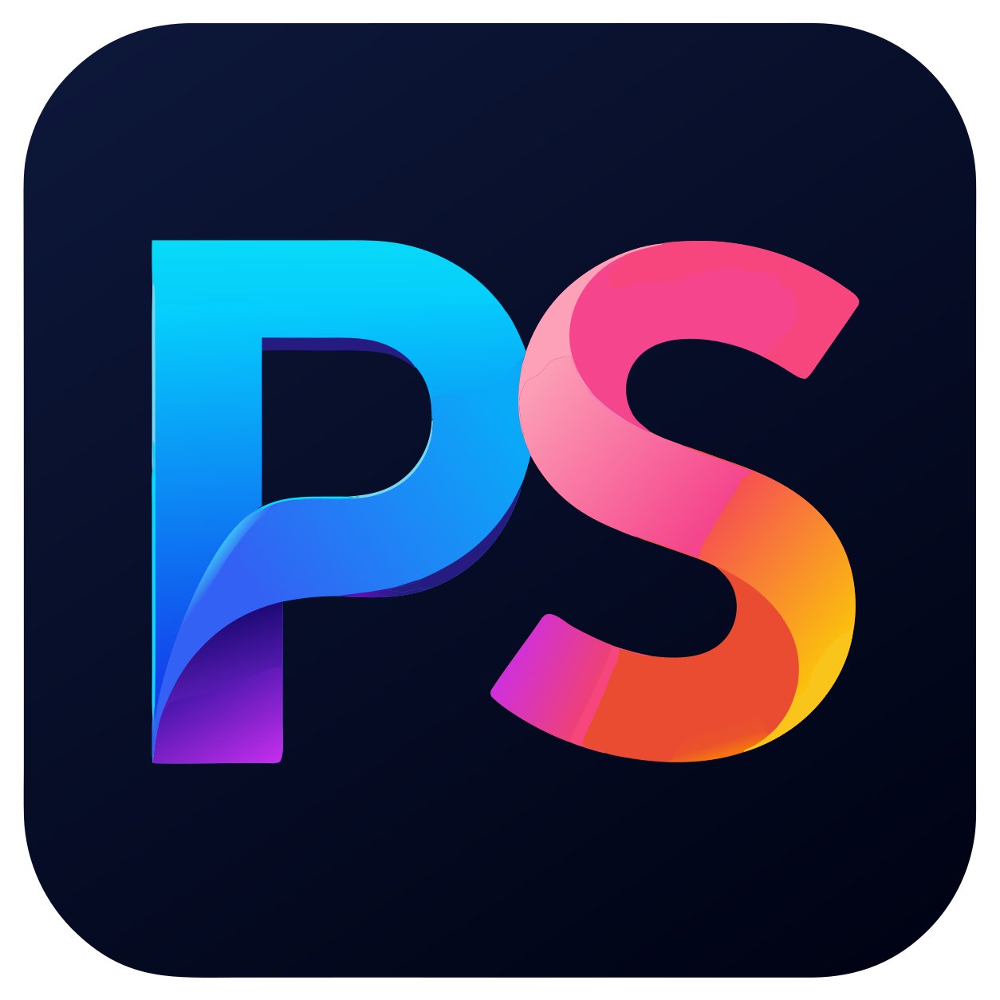

<p align="center">
  
</p>

<h1 align="center">PhotoSuite</h1>

<p align="center">
  <strong>A desktop image editor, faithful to classic Adobe Photoshop, with native PSD/PSB compatibility - written entirely in Rust.</strong>
</p>

<p align="center">
  <a href="https://github.com/eolix/photosuite/actions/workflows/build.yml"></a>
  
  
  
</p>

<p align="center">
  <a href="#downloads">Downloads</a> •
  <a href="#what-this-is">What this is</a> •
  <a href="#features">Features</a> •
  <a href="#file-formats">File formats</a> •
  <a href="#building-from-source">Building</a> •
  <a href="#licences">Licences</a>
</p>

---

PhotoSuite is built on [PhotoCraft](https://github.com/storytold/photocraft), an open-source
Rust image-editing engine (MIT OR Apache-2.0): its document model, PSD reader and writer,
compositor and command system are the foundation, with PhotoSuite's interface, tools and features
on top.

> PhotoSuite's intention is to fully suppport Photoshop-PhotoSuite PSD round trips, with 
> all effects and smart objects/filters. It's a work in progress.
> It was originally clean-room written in JS with a Rust engine (Tauri), but it has since
> taken a more modern, performant approach. The Javascript version still lives in many forks.

## Downloads

Installers are on the **[Releases](https://github.com/eolix/photosuite/releases)** page.

| Platform | Packages | Architecture |
|:---|:---|:---|
| **macOS** 11+ | `.dmg` (and a command-line `.zip`) | Universal: Apple silicon and Intel |
| **Windows** 10+ | `.msi` installer, portable `.zip` | x64 |
| **Linux** | `.AppImage`, `.deb`, `.rpm`, Arch Linux `.pkg.tar.zst`, `.tar.gz` | x86_64 and arm64 |
| **Linux** | `.flatpak` | x86_64 |

On Linux, pick the package for your distribution (`<version>` and `<arch>` as in the file name):

```sh
sudo apt install ./photosuite-<version>-linux-<arch>.deb          # Debian, Ubuntu, Mint, Pop!_OS
sudo dnf install ./photosuite-<version>-linux-<arch>.rpm          # Fedora, RHEL (openSUSE: zypper install)
sudo pacman -U photosuite-<version>-linux-<arch>.pkg.tar.zst      # Arch Linux, Manjaro, EndeavourOS
flatpak install --user photosuite-<version>-linux-x86_64.flatpak  # any distribution with Flatpak
```

The AppImage needs no installation (`chmod +x` it and run it) and carries update information, so
[AppImageUpdate](https://github.com/AppImageCommunity/AppImageUpdate) fetches only what changed
in a new release.

## What this is

A native desktop editor that tries to work the way Photoshop does: menus where you expect them,
the same shortcuts and modifier keys, dialogs with the same fields, and PSD as a first-class
format rather than an import filter. If you know Photoshop, most of PhotoSuite will feel familiar.
It does not do everything Photoshop does, and where it differs, the issues are open for it.

- **Native.** egui on wgpu (Metal, Vulkan, DirectX 12), with a CPU fallback. No Electron, no
  web view, no JavaScript.
- **Local and private.** No account, no telemetry, no cloud. Your files stay on your machine.
- **Scriptable.** Every action is a command, the same ones the menus run, so the CLI, a JSON
  control channel and an MCP server for AI agents can do anything the interface can.

> Not affiliated with or endorsed by Adobe. Photoshop is a registered trademark of Adobe Inc.,
> named here only to describe the interface and behaviour PhotoSuite follows. PhotoSuite is
> independent of, and not endorsed by, the PhotoCraft project.

## What this is not

A GIMP or Affinity replacement with a feature for everything. The goal is narrower: a free,
legal way for designers to open, edit and save PSDs with tools they already know. Anything
beyond that can be a [plug-in](docs/plugins.md).

## Features

**Documents and layers**
- Pixel, type, shape, fill and adjustment layers; groups, clipping masks, layer masks and
  vector masks; all of Photoshop's blend modes.
- Layer styles: Drop Shadow, Inner Shadow, Outer and Inner Glow, Bevel & Emboss, Satin, Color,
  Gradient and Pattern Overlay, Stroke.
- Smart Objects (embedded and linked) with Smart Filters.
- 8, 16 and 32-bit documents in RGB, Grayscale, CMYK and Lab, with its own ICC colour
  management engine.

**Tools**
- Marquee, Lasso, Polygonal and Magnetic Lasso, Magic Wand, Quick and Object Selection, Select
  Subject, Select and Mask.
- Brush, Pencil, Eraser, Clone Stamp, Healing, Gradient (live and classic), Paint Bucket,
  Dodge, Burn, Sponge, Blur, Sharpen, Smudge.
- Pen and shape tools, custom shapes, Type (point, paragraph, on a path, warped), Crop,
  Ruler, Hand, Zoom, Eyedropper.

**Adjustments and filters**
- Adjustment layers and Image › Adjustments, including Curves, Levels, Hue/Saturation and
  Color Lookup (3D LUTs, and ICC abstract and device-link profiles).
- Camera Raw: develop raw files and use it as a filter.
- Lens Correction with measured lens profiles from the
  [Lensfun](https://github.com/lensfun/lensfun) database.
- Liquify, Puppet Warp, Perspective Warp, Vanishing Point, Content-Aware Fill and Scale, the
  Filter Gallery and the classic filter menus.

**Automation and integration**
- Actions, Batch, droplets and script events.
- `photosuite-cli` for headless conversion and scripted edits, plus a JSON control channel and
  an MCP server (see [docs/control-protocol.md](docs/control-protocol.md)).
- Sandboxed WebAssembly filter plug-ins ([docs/plugins.md](docs/plugins.md)).
- Native menus on macOS, six themes, adjustable UI font size, and 38 interface languages.

**Bundled libraries**: Color Lookup presets, gradients, brushes, patterns and custom shapes,
each under its own licence (see [Licences](#licences)).

## File formats

| | Open | Save |
|:---|:---|:---|
| **Layered** | PSD, PSB, PhotoSuite (`.pcraft`) | PSD, PSB |
| **Raster** | PNG, JPEG, WebP, TIFF, GIF, BMP, TGA, ICO, QOI, OpenEXR, Radiance HDR, PBM/PGM/PPM/PAM/PFM, HEIC/HEIF | PNG, JPEG, WebP (lossy and lossless), TIFF, OpenEXR, GIF, PNG-8, WBMP |
| **Document** | PDF (a page, as pixels) | PDF (flattened) |
| **Camera raw** | DNG, CR2, CR3, NEF, NRW, ARW, PEF, ORF, RW2, RAF | — |
| **Presets** | Brushes (`.abr`), gradients (`.grd`), patterns (`.pat`), custom shapes (`.csh`), 3D LUTs (`.cube`, `.3dl`, `.look`) | — |

## Building from source

Rust stable (1.90 or later). Linux also needs
`libxkbcommon-dev libwayland-dev libx11-dev libxrandr-dev libxi-dev libgl1-mesa-dev libgtk-3-dev`.

```sh
cargo run --release -p photosuite      # the desktop app
cargo test --workspace                 # the tests
scripts/dev-macos.sh some/file.psd     # macOS: fast development build, opening a file
```

Installers are built by the scripts in [`packaging/`](packaging) (the same ones CI runs).
[docs/development.md](docs/development.md) covers profiles, debugging and the test corpora;
[docs/architecture.md](docs/architecture.md) explains how the code is organised, and
[docs/contributing.md](docs/contributing.md) the rules for changes.

## Licences

PhotoSuite is licensed under either of the [MIT licence](LICENSE-MIT) or the
[Apache License 2.0](LICENSE-APACHE), at your option. [`NOTICE`](NOTICE) carries the required
attributions, including PhotoCraft's.

It bundles third-party material under its own licences, each with its licence file beside it.
[`THIRD-PARTY-NOTICES.md`](THIRD-PARTY-NOTICES.md) lists them file by file.

| Material | Author | Licence |
|:---|:---|:---|
| [PhotoCraft](https://github.com/storytold/photocraft) engine | ArtCraft Team and the PhotoCraft contributors | MIT OR Apache-2.0 |
| [Inter](https://rsms.me/inter/), [JetBrains Mono](https://www.jetbrains.com/lp/mono/) fonts | The Inter and JetBrains Mono authors | SIL OFL 1.1 |
| [Tabler Icons](https://github.com/tabler/tabler-icons) | Paweł Kuna | MIT |
| [Lucide](https://lucide.dev) icons | Lucide contributors (some from Feather, Cole Bemis) | ISC, MIT |
| [SCOWL](http://wordlist.aspell.net) word list (spell checking) | Kevin Atkinson and contributors | SCOWL |
| [Lensfun](https://github.com/lensfun/lensfun) lens database (adapted) | The Lensfun contributors | CC BY-SA 3.0 |
| [Fresh LUTs](https://freshluts.com) Color Lookup presets | Fresh LUTs uploaders | CC0 |
| [uiGradients](https://github.com/Ghosh/uiGradients) gradients | Indrashish Ghosh and contributors | MIT |
| [Subtle Patterns](https://www.toptal.com/designers/subtlepatterns/) patterns (adapted) | Toptal and the pattern designers | CC BY-SA 3.0 |
| [Brusheezy](https://www.brusheezy.com) brush packs (unmodified) | brushchick, lovelace, stuffwemake | CC BY-ND, CC BY-SA |
| [Font Awesome Free](https://fontawesome.com) shapes (converted) | Fonticons, Inc. | CC BY 4.0 |
| PDFium's standard fonts, inside the [hayro](https://github.com/LaurenzV/hayro) PDF renderer | PDFium authors | BSD-3-Clause |

The Rust crates PhotoSuite links (egui, wgpu, hayro and many more) are under their own
permissive licences, listed with their texts in [`THIRD-PARTY-CRATES.md`](THIRD-PARTY-CRATES.md).
