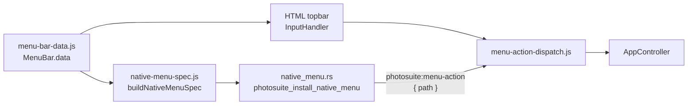

# Menu bar

PhotoSuite has one menu definition. All application menus (File, Edit, Image, Layer, Select, Filter, View, Window, and nested items) are declared in JavaScript and drive both the in-window menu strip and the macOS system menu bar.

## Source of truth

Edit **`menu-bar-data.js`** only.

- **`items`** — visible rows: locale keys (`name`), shortcuts (`cX`), optional **`resolveRowState`**, ellipsis (`Ip`), nested `sub` menus, separators (`uJ`), etc.
- **`menuActions`** — parallel tree at the same indices: `{ appEventType, documentModelType?, payload?, sub? }`. This is what runs when the user picks a command.

`createMenuBarData()` builds the frozen tree assigned to `MenuBar.data` in `ui.js`. The Window menu can depend on runtime sidebar metadata; everything else is static data in that file.

You do **not** add or change menu commands in Rust for normal menu work.

## Runtime flow



1. **`buildNativeMenuSpec(menuData, doc, appData)`** walks `items` + `menuActions`, resolves labels via `Locale`, enabled state via the same `resolveRowState` callbacks as the HTML menu, and maps shortcuts to Tauri accelerators.
2. **`installNativeMenuFromMenuBarData`** / **`refreshNativeMenuFromMenuBarData`** (`tauri-menu-bridge.js`) invoke `photosuite_install_native_menu` with that spec.
3. On macOS, the shell builds native `NSMenu` entries; each actionable item gets id `ps/menu/<top>/<leaf>/…` matching its **`path`** (menu indices).
4. Activation emits **`photosuite:menu-action`** with `{ path: number[] }`. The webview resolves the path through `resolveMenuBarAction` and dispatches the same `AppEvent` as a click in the HTML menu.

Non-macOS hosts keep the HTML `.topbar`; the native install command is a no-op there.

## Adding or changing a menu item

1. In **`menu-bar-data.js`**, add or edit the matching pair in the target top menu’s `items` and `menuActions` arrays (same index). For a submenu, add parallel entries under `items[].sub` and `menuActions[].sub`.
2. Use existing patterns for `appEventType` / `documentModelType` / `payload` (see neighboring entries).
3. Optional **`resolveRowState(doc, appData, rowIndex)`** on the **item** row (not on `menuActions`):
   - `{ enabled: false }` — greyed out / disabled
   - `{ labelOverride: "…" }` — dynamic label (e.g. Save with source hint)
   - `{ checked: true }` — checkmark in the HTML menu (View toggles)
4. Optional **`cX`** shortcut array; native accelerators are derived automatically.
5. After changing labels, enabled rules, or locale-dependent text, call **`appController.refreshNativeMenuBar()`** (see below).

Path for a new command = `[topMenuIndex, menuActionIndex, …subIndices]`. Top-level order matches `MenuBar.data`: File `0`, Edit `1`, Image `2`, Layer `3`, Select `4`, Filter `5`, View `6`, Window `7`.

## Enabled (greyed out) state

Both the HTML dropdown (`InputHandler.update`) and the macOS native bar (`native-menu-spec.js` → `resolveMenuItemEnabled`) call the same callback on each `items[]` row:

```js
resolveRowState: function (doc, appData, rowIndex) {
  return { enabled: doc != null };
}
```

**If a row has no `resolveRowState`, it is always enabled** (HTML class `enab`, native `enabled: true`).

Both UIs grey out rows when `resolveRowState` returns `{ enabled: false }`. Use **`resolveRowState`** on the item row — not a static `enabled` property (that is ignored).

`refreshNativeMenuBar()` must run after document or locale changes so the native menu picks up new `enabled` values.

## Refreshing the native menu bar

Call **`appController.refreshNativeMenuBar()`** when menu labels or enabled state must match a new document or locale — for example after switching documents or `PopupTypes.CHANGE_LANGUAGE`. Install happens once at startup; refresh rebuilds the spec from current `MenuBar.data`, doc, and `Locale`.

## macOS chrome

On macOS, a successful native install sets `body.photosuite-hide-html-menu` and hides the in-window `.topbar`. Layout code must not reserve height for the hidden bar (see `AppController.resize`).

## Rust (`src-tauri/src/native_menu.rs`)

Rust is a **renderer**, not a second menu definition:

- Deserializes the JSON spec from the webview.
- Builds menus and forwards clicks as `{ path }` events.
- Does not encode application commands beyond wiring.

**macOS App menu only:** the platform submenu (app name) uses `PredefinedMenuItem` for About, Services, Hide, Show All, and Quit. **Preferences** is a single bridge item that fires path `[1, 18]` (Edit → Preferences in `menu-bar-data.js`); keep that path in sync if the Edit menu layout changes.

## Testing menu actions

From the webview console:

```js
await window.__TAURI__.core.invoke("photosuite_emit_menu_action", {
  payload: { path: [0, 0] }  // e.g. File → New
});
```

Or send a full descriptor: `{ action: { appEventType, documentModelType?, payload? } }`.

## Module map

| Module | Role |
|--------|------|
| `menu-bar-data.js` | Menu tree definition (`items` + `menuActions`) |
| `menu-bar-predicates.js` | Shared `resolveRowState` helpers |
| `menu-action-dispatch.js` | Path → descriptor → `AppEvent` |
| `native-menu-spec.js` | `MenuBar.data` → Tauri install spec; `isMacOSHost()` |
| `tauri-menu-bridge.js` | Install, refresh, event listeners, HTML bar hide |
| `native_menu.rs` | Native menu build + `photosuite:menu-action` emit |
